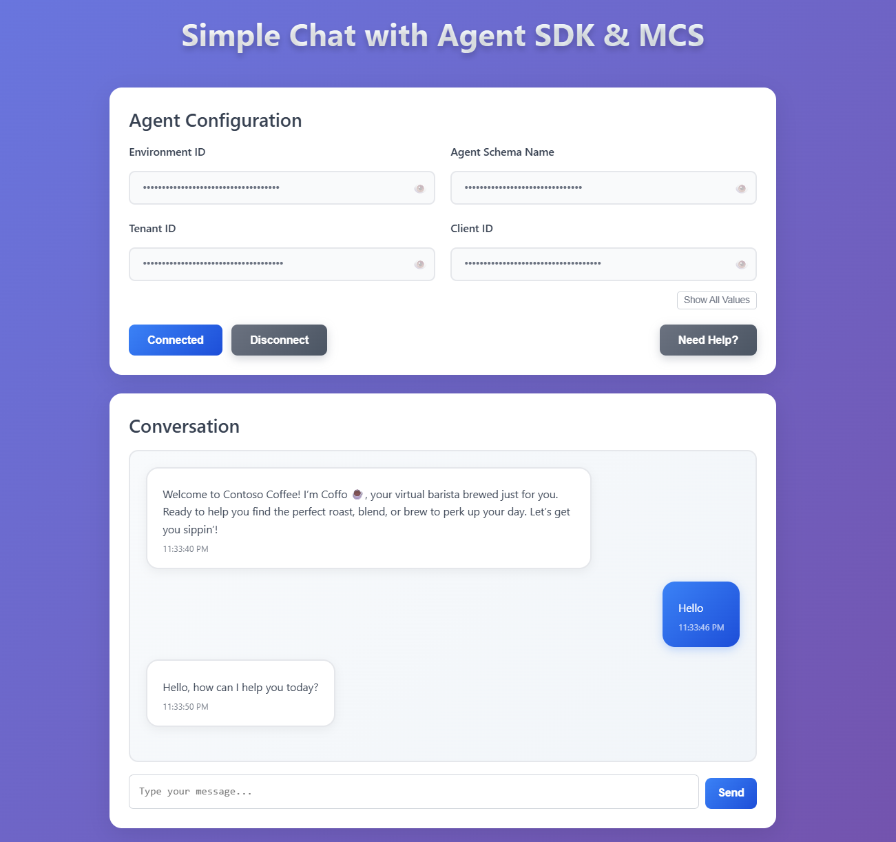

# Copilot Studio Chat Sample

A modern React application that demonstrates how to interact with Microsoft Copilot Studio agents using the Copilot Studio Agent SDK. This sample provides a clean, professional chat interface with authentication and real-time messaging capabilities.



*Beautiful, modern chat interface with gradient design and intuitive configuration panel*

## Features

- 🚀 **Modern React Architecture**: Built with React 18, TypeScript, and Vite
- 🔐 **Azure Authentication**: Secure authentication using MSAL (Microsoft Authentication Library)
- 💬 **Real-time Chat**: Interactive chat interface with Copilot Studio agents
- 🎨 **Modern UI**: Beautiful gradient design with glass morphism effects
- 🔒 **Security**: Sensitive configuration values are masked with toggle visibility
- 📱 **Responsive**: Works seamlessly on desktop and mobile devices
- 🛠️ **Developer Friendly**: Hot reload, TypeScript support, and clean architecture

## Project Structure

```
mcs-sample-chat/
├── src/
│   ├── components/
│   │   ├── ChatPage.tsx              # Main chat interface
│   │   ├── index.ts                  # Component exports
│   │   ├── chat/
│   │   │   ├── MessageContent.tsx    # Message formatting component
│   │   │   └── index.ts              # Chat component exports
│   │   ├── common/
│   │   │   ├── TroubleshootingGuide.tsx  # Authentication help modal
│   │   │   └── index.ts              # Common component exports
│   │   └── configuration/            # Future configuration components
│   ├── services/
│   │   ├── authenticationService.ts  # MSAL authentication service
│   │   ├── copilotStudioService.ts   # Copilot Studio API service
│   │   └── index.ts                  # Service exports
│   ├── types/
│   │   └── index.ts                  # TypeScript type definitions
│   ├── utils/
│   │   └── index.ts                  # Utility functions and helpers
│   ├── styles/
│   │   └── globals.css               # Global styles and themes
│   ├── App.tsx                       # Root application component
│   ├── main.tsx                      # Application entry point
│   └── vite-env.d.ts                 # Vite environment types
├── resources/
│   └── images/
│       └── home.png                  # Application screenshot
├── .env.example                      # Environment variables template
├── .env                              # Environment variables (local)
├── package.json                      # Dependencies and scripts
├── vite.config.ts                    # Vite configuration
├── tsconfig.json                     # TypeScript configuration
├── tsconfig.node.json                # TypeScript Node configuration
├── index.html                        # HTML entry point
├── LICENSE                           # MIT License
└── README.md                         # Project documentation
```

## Prerequisites

Before you can run this application, you'll need to set up both a Copilot Studio agent and an Azure App Registration.

## Create an Agent in Copilot Studio

1. Create an Agent in [Copilot Studio](https://copilotstudio.microsoft.com)
    1. Publish your newly created Copilot
    2. Goto Settings => Advanced => Metadata and copy the following values, You will need them later:
        1. Schema name
        2. Environment Id

## Create an Application Registration in Entra ID

This step will require permissions to create application identities in your Azure tenant. For this sample, you will create a Native Client Application Identity, which does not have secrets.

1. Open https://portal.azure.com 
2. Navigate to Entra Id
3. Create a new App Registration in Entra ID 
    1. Provide a Name
    2. Choose "Accounts in this organization directory only"
    3. In the "Select a Platform" list, Choose "Single-page application (SPA)" 
    4. In the Redirect URI url box, type in `http://localhost:3000` (**note: use HTTP, not HTTPS**)
    5. Then click register.
4. In your newly created application
    1. On the Overview page, Note down for use later when configuring the example application:
        1. The Application (client) ID
        2. The Directory (tenant) ID
    2. Go to API Permissions in `Manage` section
    3. Click Add Permission
        1. In the side panel that appears, Click the tab `API's my organization uses`
        2. Search for `Power Platform API`.
            1. *If you do not see `Power Platform API` see the note at the bottom of this section.*
        3. In the *Delegated permissions* list, choose `CopilotStudio` and Check `CopilotStudio.Copilots.Invoke`
        4. Click `Add Permissions`
    4. (Optional) Click `Grant Admin consent for copilotstudio`

> [!TIP]
> If you do not see `Power Platform API` in the list of API's your organization uses, you need to add the Power Platform API to your tenant. To do that, goto [Power Platform API Authentication](https://learn.microsoft.com/power-platform/admin/programmability-authentication-v2#step-2-configure-api-permissions) and follow the instructions on Step 2 to add the Power Platform Admin API to your Tenant

## Getting Started

### 1. Clone and Install

```bash
# Clone the repository
git clone <repository-url>
cd mcs-sample-chat

# Install dependencies
npm install
```

### 2. Configure Environment Variables

Create a `.env` file in the root directory by copying from the template:

```bash
cp .env.example .env
```

Configure the values based on what was recorded during the setup phase:

```bash
# .env
VITE_ENVIRONMENT_ID=""      # Environment ID of environment with the CopilotStudio App
VITE_AGENT_IDENTIFIER=""    # Schema Name of the Copilot to use
VITE_TENANT_ID=""           # Tenant ID of the App Registration used to login
VITE_APP_CLIENT_ID=""       # App ID of the App Registration used to login
```

### 3. Run the Application

```bash
# Start the development server
npm run dev
```

The application will be available at `http://localhost:3000` (or the next available port if 3000 is in use)

> **Note**: If port 3000 is already in use, Vite will automatically use the next available port (e.g., 3001). Make sure your Azure App Registration redirect URI matches the actual port being used.

## Available Scripts

- `npm run dev` - Start the development server with hot reload
- `npm run build` - Build the application for production
- `npm run preview` - Preview the production build locally
- `npm run lint` - Run ESLint for code quality checks

## How to Use

1. **Configure Agent Settings**: Fill in the required configuration fields in the app
2. **Authenticate**: Click "Connect" to sign in with your Microsoft account
3. **Start Chatting**: Once connected, type your message and press Enter or click Send
4. **Get Help**: Click the "?" button for authentication troubleshooting

## Troubleshooting

### Authentication Issues

If you encounter authentication problems:

1. Verify your App Registration settings in Azure Portal
2. Ensure the redirect URI matches exactly: `http://localhost:3000` (or the actual port if different)
3. Check that the Power Platform API permissions are granted
4. Confirm your agent is published in Copilot Studio

> **Important**: If your development server runs on a different port (e.g., 3001), you must update the redirect URI in your Azure App Registration to match the actual port.

### Common Errors

- **"Failed to get access token"**: Check your tenant ID and client ID
- **"Agent not found"**: Verify the environment ID and agent identifier
- **"Permission denied"**: Ensure proper API permissions are configured

## Technologies Used

- **React 18.3.1** - Modern React with hooks and concurrent features
- **TypeScript 5.2.2** - Type-safe JavaScript development
- **Vite 5.3.1** - Fast build tool and development server
- **MSAL Browser 3.24.0** - Microsoft Authentication Library
- **Copilot Studio Agent SDK 1.0.0** - Official SDK for agent integration
- **Sonner 1.5.0** - Beautiful toast notifications

## Contributing

1. Fork the repository
2. Create a feature branch (`git checkout -b feature/amazing-feature`)
3. Commit your changes (`git commit -m 'Add some amazing feature'`)
4. Push to the branch (`git push origin feature/amazing-feature`)
5. Open a Pull Request

## License

This project is licensed under the MIT License - see the [LICENSE](LICENSE) file for details.

## Support

For issues and questions:
- Check the [Troubleshooting Guide](#troubleshooting) above
- Review the [Copilot Studio documentation](https://docs.microsoft.com/microsoft-copilot-studio/)
- Open an issue in this repository

---

**Note**: This is a sample application for demonstration purposes. Please review and modify the code according to your security and production requirements before deploying to production environments.